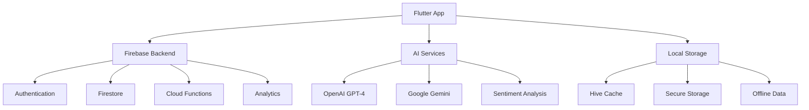

# 🌌 HealPray - Your Daily Healing & Prayer Companion

<div align="center">
  


[](https://flutter.dev)
[](https://firebase.google.com)
[]()
[]()

**An AI-powered emotional and spiritual wellness companion that provides personalized prayers, verses, and healing guidance.**

[🚀 Get Started](#-getting-started) • [📖 Documentation](#-documentation) • [🎨 Design System](#-design-system) • [🛠️ Contributing](#-contributing)

</div>

---

## 🎯 **Vision**

HealPray transforms daily spiritual practice through intelligent mood adaptation, personalized prayer generation, and continuous emotional support. We believe technology can deepen, not replace, authentic spiritual connection.

### ✨ **Key Features**

- 🧠 **AI-Powered Prayer Generation** - Personalized prayers based on your mood and spiritual needs
- 📊 **Mood Tracking & Analytics** - Visual insights into your emotional and spiritual journey  
- 🔔 **Smart Notifications** - Contextual prayers delivered at optimal times
- 🧘 **Guided Meditation** - 9 meditation types including Mindfulness, Healing, Sleep, and Spiritual practices
- 🎵 **Audio & Voice Experience** - Natural voice reading with ambient soundscapes
- 💬 **Conversational AI Companion** - Empathetic support when you need it most
- 🌐 **Community Features** - Anonymous prayer circles and shared reflections
- ⚡ **Offline-First Design** - Access your prayers anywhere, anytime
- 🌙 **Crisis Support Integration** - Professional help when you need it most

---

## 🏗️ **Architecture Overview**



### **Tech Stack**

- **Frontend**: Flutter 3.16+ with Riverpod state management
- **Backend**: Firebase (Auth, Firestore, Functions, Analytics)
- **AI**: OpenAI GPT-4, Google Gemini Pro, Custom sentiment models
- **Storage**: Hive for local data, Firebase for cloud sync
- **Notifications**: Firebase Cloud Messaging + Local notifications
- **Audio**: Flutter TTS, Just Audio for ambient sounds

---

## 🚀 **Getting Started**

### **Prerequisites**

- Flutter SDK 3.16.0 or higher
- Dart SDK 3.2.0 or higher
- iOS 12.0+ / Android API 21+
- Firebase project setup
- AI service API keys (OpenAI, Google)

### **Installation**

1. **Clone the repository**
   ```bash
   git clone https://github.com/your-org/healpray-ai-prayer-app.git
   cd healpray-ai-prayer-app
   ```

2. **Install Flutter dependencies**
   ```bash
   cd healpray_mobile
   flutter pub get
   ```

3. **Configure environment variables**
   ```bash
   cp .env.example .env
   # Add your API keys and configuration
   ```

4. **Set up Firebase**
   ```bash
   # Follow Firebase setup instructions in docs/firebase-setup.md
   ```

5. **Run the app**
   ```bash
   flutter run
   ```

### **Development Setup**

```bash
# Generate required files
flutter packages pub run build_runner build --delete-conflicting-outputs

# Run with different environments
flutter run --dart-define-from-file=config/dev.json     # Development
flutter run --dart-define-from-file=config/staging.json # Staging
flutter run --dart-define-from-file=config/prod.json    # Production
```

---

## 📖 **Documentation**

| Document | Description |
|----------|-------------|
| [📋 Project Blueprint](HEALPRAY_BLUEPRINT.md) | Complete project specifications |
| [🎨 Brand Guidelines](branding/style_guide.md) | Visual identity and design system |
| [🔧 API Documentation](docs/api_documentation.md) | Backend APIs and integrations |
| [🚀 Deployment Guide](docs/deployment_guide.md) | Production deployment instructions |
| [🧪 Testing Guide](docs/testing_guide.md) | Testing strategies and protocols |
| [🔒 Security Guide](docs/security_guide.md) | Security best practices |

---

## 🎨 **Design System**

### **Colors**
```css
/* Primary Palette */
--sunrise-gold: #FFD700;    /* Hope & New Beginnings */
--healing-teal: #4ECDC4;    /* Peace & Renewal */
--midnight-blue: #2C3E50;   /* Depth & Reflection */
--pure-white: #FFFFFF;      /* Purity & Clarity */
```

### **Typography**
- **Primary**: Poppins (Modern, readable, friendly)
- **Secondary**: Nunito Sans (Clean, professional)

### **Component Library**
- Material Design 3 foundation
- Custom HealPray design tokens
- Accessible, inclusive design principles

---

## 🗂️ **Project Structure**

```
healpray/
├── 📱 healpray_mobile/          # Flutter application
│   ├── lib/
│   │   ├── core/                # Core utilities and constants  
│   │   ├── features/            # Feature modules
│   │   └── shared/              # Shared widgets and services
│   └── assets/                  # Images, fonts, animations
├── ☁️ backend/                  # Firebase Cloud Functions
├── 🎨 branding/                 # Brand assets and guidelines  
├── 📄 docs/                     # Project documentation
├── 🧪 tests/                    # Test suites
└── 🚀 deployment/               # Deployment configurations
```

---

## 🔧 **Development Workflow**

### **Branch Strategy**
- `main` - Production-ready code
- `develop` - Integration branch
- `feature/*` - Feature development
- `hotfix/*` - Production fixes

### **Commit Convention**
```
type(scope): description

feat(auth): add biometric authentication
fix(prayer): resolve AI generation timeout
docs(readme): update installation guide
style(ui): improve button hover states
```

### **Code Quality**
- Very Good Analysis linting rules
- 90%+ test coverage requirement
- Automated PR checks with GitHub Actions
- Code review required for all changes

---

## 🧪 **Testing**

```bash
# Unit tests
flutter test

# Widget tests  
flutter test --coverage

# Integration tests
flutter drive --target=test_driver/app.dart

# E2E tests with Patrol
patrol test --target integration_test/app_test.dart
```

### **Testing Strategy**
- **Unit Tests**: Business logic, utilities, services
- **Widget Tests**: UI components and interactions  
- **Integration Tests**: Feature workflows
- **E2E Tests**: Critical user journeys

---

## 🚀 **Deployment**

### **Environments**
- **Development**: Local testing and development
- **Staging**: Pre-production testing
- **Production**: Live app store releases

### **Release Process**
1. Feature development in feature branches
2. PR review and automated testing
3. Staging deployment and QA testing
4. Production release with semantic versioning
5. App Store submission and monitoring

---

## 🔒 **Security & Privacy**

### **Data Protection**
- End-to-end encryption for sensitive data
- GDPR and CCPA compliance
- Minimal data collection principle
- User data ownership and portability

### **AI Ethics**
- Transparent AI decision-making
- Bias detection and mitigation  
- Cultural sensitivity in content generation
- Crisis intervention protocols

---

## 🌍 **Localization**

### **Supported Languages**
- 🇺🇸 English (Primary)
- 🇪🇸 Spanish  
- 🇵🇹 Portuguese
- 🇫🇷 French
- 🇮🇳 Hindi
- 🇰🇪 Swahili

### **Cultural Adaptation**
- Denomination-specific prayers
- Cultural prayer styles and traditions
- Local religious calendar integration
- Region-specific crisis support resources

---

## 📊 **Analytics & Monitoring**

### **Key Metrics**
- Daily Active Users (DAU)
- Prayer completion rate
- Mood improvement trends  
- AI conversation engagement
- Crisis intervention effectiveness

### **Tools**
- Firebase Analytics
- Crashlytics for error tracking
- Custom dashboard for wellness metrics
- A/B testing for feature optimization

---

## 🛠️ **Contributing**

We welcome contributions from developers, designers, and spiritual advisors who share our mission of combining technology with healing.

### **How to Contribute**
1. Fork the repository
2. Create a feature branch
3. Make your changes with tests
4. Submit a pull request
5. Participate in code review

### **Contribution Guidelines**
- Follow the code style and conventions
- Write tests for new features
- Update documentation as needed
- Respect our code of conduct
- Consider accessibility and inclusivity

### **Code of Conduct**
We are committed to fostering an inclusive, respectful, and harassment-free environment for all contributors, regardless of background, faith, or experience level.

---

## 📜 **License**

This project is proprietary software owned by HealPray Technologies. Unauthorized copying, modification, or distribution is prohibited.

For licensing inquiries, contact: licensing@healpray.app

---

## 🔄 **Recent Updates**

### **v0.2.0** (Latest)
- ✅ Fixed navigation routing issues (Settings → Notifications)
- ✅ Fixed Settings screen title visibility on gradient background
- ✅ Implemented Guided Meditation feature with 9 meditation types
- ✅ Fixed type casting errors in Analytics Dashboard
- ✅ Added meditation filtering by type (Mindfulness, Healing, Gratitude, etc.)
- ✅ Improved UI consistency across all screens
- 🚧 Prayer Journal feature (in development)
- 🚧 Scripture Reading feature (in development)
- 🚧 Community screen enhancements (in development)

### **v0.1.0** (Initial Release)
- 🎉 Core prayer generation functionality
- 📊 Mood tracking and analytics
- 💬 AI chat companion with Gemini integration
- 🎨 Beautiful gradient UI with glassmorphism design
- 🔔 Notification settings and preferences
- 📈 Analytics dashboard with A/B testing

---

## 🤝 **Support & Community**

### **Get Help**
- 📚 [Documentation](docs/)
- 💬 [Discord Community](https://discord.gg/healpray)
- 🐛 [Issue Tracker](https://github.com/your-org/healpray-ai-prayer-app/issues)
- 📧 [Support Email](mailto:support@healpray.app)

### **Stay Connected**
- 🌐 [Website](https://healpray.app)
- 📱 [Download App](https://apps.apple.com/app/healpray)
- 🐦 [Twitter](https://twitter.com/healpray)
- 📘 [Facebook](https://facebook.com/healprayapp)
- 📸 [Instagram](https://instagram.com/healpray)

---

## 🙏 **Acknowledgments**

Special thanks to:
- The spiritual advisors who guided our content curation
- Beta testers who provided invaluable feedback
- Open source contributors who made this possible
- Mental health professionals who advised on crisis protocols
- The Flutter and Firebase teams for excellent tooling

---

<div align="center">

**Built with ❤️ and 🙏 by the HealPray Team**

*Transforming spiritual practice through compassionate technology*

</div>
