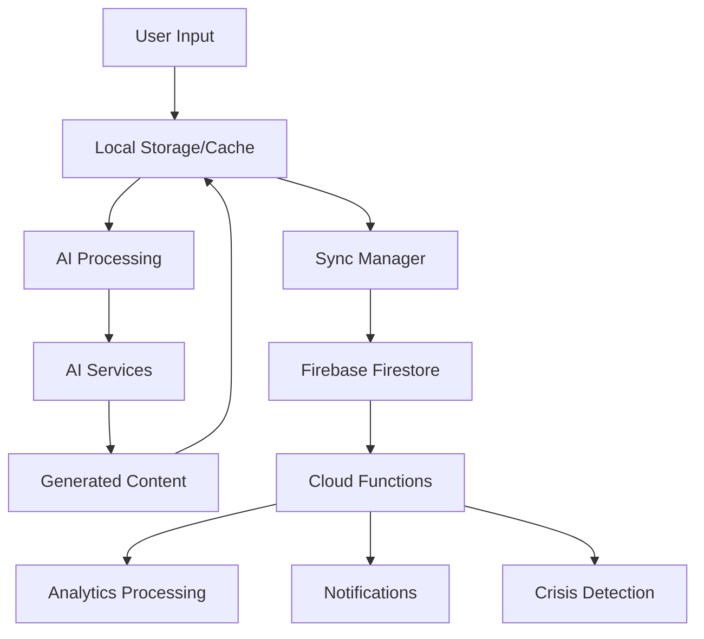

# 🏗️ HealPray - Advanced Technical Architecture
## Comprehensive System Design & Implementation Guide

---

## 🎯 **System Overview**

HealPray is built on a modern, scalable, cloud-native architecture that combines Flutter's cross-platform capabilities with Firebase's robust backend services and cutting-edge AI technologies.

### **Core Principles**
- **Offline-First**: Seamless functionality without internet connectivity
- **AI-Driven**: Personalized experiences through machine learning
- **Scalable**: Architecture supports millions of users
- **Secure**: End-to-end encryption and privacy-first design
- **Accessible**: WCAG 2.1 AA compliance and inclusive design

---

## 🏛️ **Architecture Patterns**

### **Clean Architecture**
```
┌─────────────────────────────────────┐
│             Presentation            │  ← UI, Widgets, Pages
├─────────────────────────────────────┤
│              Application            │  ← Use Cases, Providers
├─────────────────────────────────────┤
│               Domain                │  ← Entities, Repositories
├─────────────────────────────────────┤
│             Infrastructure          │  ← Data Sources, Services
└─────────────────────────────────────┘
```

### **Feature-Based Structure**
Each feature is self-contained with its own:
- Data layer (repositories, data sources)
- Domain layer (entities, use cases)
- Presentation layer (pages, widgets, providers)

---

## 📱 **Frontend Architecture**

### **Flutter Application Structure**

```
lib/
├── 🎯 core/                          # Shared application core
│   ├── constants/                    # App constants and enums
│   │   ├── app_constants.dart
│   │   ├── api_endpoints.dart
│   │   ├── storage_keys.dart
│   │   └── notification_types.dart
│   ├── utils/                        # Utility functions
│   │   ├── logger.dart
│   │   ├── validators.dart
│   │   ├── date_utils.dart
│   │   ├── encryption_utils.dart
│   │   └── prayer_text_utils.dart
│   ├── theme/                        # App theming
│   │   ├── app_theme.dart
│   │   ├── colors.dart
│   │   ├── typography.dart
│   │   ├── dimensions.dart
│   │   └── dark_theme.dart
│   ├── services/                     # Core services
│   │   ├── analytics_service.dart
│   │   ├── crashlytics_service.dart
│   │   ├── notification_service.dart
│   │   ├── audio_service.dart
│   │   └── background_service.dart
│   ├── config/                       # Configuration
│   │   ├── app_config.dart
│   │   ├── firebase_config.dart
│   │   └── ai_config.dart
│   └── error/                        # Error handling
│       ├── exceptions.dart
│       ├── failures.dart
│       └── error_handler.dart
├── 🎭 features/                      # Feature modules
│   ├── 🔐 authentication/            # User authentication
│   │   ├── data/
│   │   │   ├── datasources/
│   │   │   │   ├── auth_local_datasource.dart
│   │   │   │   └── auth_remote_datasource.dart
│   │   │   ├── models/
│   │   │   │   ├── user_model.dart
│   │   │   │   └── auth_response_model.dart
│   │   │   └── repositories/
│   │   │       └── auth_repository_impl.dart
│   │   ├── domain/
│   │   │   ├── entities/
│   │   │   │   └── user.dart
│   │   │   ├── repositories/
│   │   │   │   └── auth_repository.dart
│   │   │   └── usecases/
│   │   │       ├── login_with_email.dart
│   │   │       ├── register_user.dart
│   │   │       ├── login_with_biometrics.dart
│   │   │       └── logout_user.dart
│   │   └── presentation/
│   │       ├── pages/
│   │       │   ├── login_page.dart
│   │       │   ├── register_page.dart
│   │       │   └── biometric_setup_page.dart
│   │       ├── providers/
│   │       │   └── auth_provider.dart
│   │       └── widgets/
│   │           ├── login_form.dart
│   │           └── biometric_button.dart
│   ├── 📊 mood_tracking/              # Mood tracking system
│   │   ├── data/
│   │   │   ├── datasources/
│   │   │   │   ├── mood_local_datasource.dart
│   │   │   │   └── mood_remote_datasource.dart
│   │   │   ├── models/
│   │   │   │   ├── mood_entry_model.dart
│   │   │   │   ├── mood_analytics_model.dart
│   │   │   │   └── mood_trend_model.dart
│   │   │   └── repositories/
│   │   │       └── mood_repository_impl.dart
│   │   ├── domain/
│   │   │   ├── entities/
│   │   │   │   ├── mood_entry.dart
│   │   │   │   ├── mood_analytics.dart
│   │   │   │   └── mood_trend.dart
│   │   │   ├── repositories/
│   │   │   │   └── mood_repository.dart
│   │   │   └── usecases/
│   │   │       ├── log_mood_entry.dart
│   │   │       ├── get_mood_history.dart
│   │   │       ├── get_mood_analytics.dart
│   │   │       └── predict_mood_trend.dart
│   │   └── presentation/
│   │       ├── pages/
│   │       │   ├── mood_check_in_page.dart
│   │       │   ├── mood_history_page.dart
│   │       │   └── mood_analytics_page.dart
│   │       ├── providers/
│   │       │   └── mood_provider.dart
│   │       └── widgets/
│   │           ├── mood_slider.dart
│   │           ├── mood_chart.dart
│   │           └── mood_insights_card.dart
│   ├── 🙏 prayer_generation/          # AI prayer generation
│   │   ├── data/
│   │   │   ├── datasources/
│   │   │   │   ├── prayer_ai_datasource.dart
│   │   │   │   ├── prayer_local_datasource.dart
│   │   │   │   └── prayer_remote_datasource.dart
│   │   │   ├── models/
│   │   │   │   ├── prayer_model.dart
│   │   │   │   ├── prayer_request_model.dart
│   │   │   │   └── prayer_template_model.dart
│   │   │   └── repositories/
│   │   │       └── prayer_repository_impl.dart
│   │   ├── domain/
│   │   │   ├── entities/
│   │   │   │   ├── prayer.dart
│   │   │   │   ├── prayer_context.dart
│   │   │   │   └── prayer_template.dart
│   │   │   ├── repositories/
│   │   │   │   └── prayer_repository.dart
│   │   │   └── usecases/
│   │   │       ├── generate_prayer.dart
│   │   │       ├── get_daily_prayers.dart
│   │   │       ├── save_prayer.dart
│   │   │       └── get_prayer_history.dart
│   │   └── presentation/
│   │       ├── pages/
│   │       │   ├── prayer_page.dart
│   │       │   ├── prayer_history_page.dart
│   │       │   └── prayer_customization_page.dart
│   │       ├── providers/
│   │       │   ├── prayer_provider.dart
│   │       │   └── prayer_audio_provider.dart
│   │       └── widgets/
│   │           ├── prayer_card.dart
│   │           ├── prayer_audio_player.dart
│   │           └── prayer_sharing_widget.dart
│   ├── 🤖 ai_conversation/            # Conversational AI
│   │   ├── data/
│   │   │   ├── datasources/
│   │   │   │   ├── conversation_ai_datasource.dart
│   │   │   │   └── conversation_local_datasource.dart
│   │   │   ├── models/
│   │   │   │   ├── conversation_model.dart
│   │   │   │   ├── message_model.dart
│   │   │   │   └── ai_response_model.dart
│   │   │   └── repositories/
│   │   │       └── conversation_repository_impl.dart
│   │   ├── domain/
│   │   │   ├── entities/
│   │   │   │   ├── conversation.dart
│   │   │   │   ├── message.dart
│   │   │   │   └── ai_context.dart
│   │   │   ├── repositories/
│   │   │   │   └── conversation_repository.dart
│   │   │   └── usecases/
│   │   │       ├── send_message.dart
│   │   │       ├── get_conversation_history.dart
│   │   │       ├── detect_crisis.dart
│   │   │       └── get_ai_suggestions.dart
│   │   └── presentation/
│   │       ├── pages/
│   │       │   ├── chat_page.dart
│   │       │   └── conversation_history_page.dart
│   │       ├── providers/
│   │       │   └── conversation_provider.dart
│   │       └── widgets/
│   │           ├── chat_bubble.dart
│   │           ├── message_input.dart
│   │           └── typing_indicator.dart
│   ├── 📈 analytics/                  # Analytics and insights
│   └── 🌍 community/                  # Community features
├── 🔄 shared/                        # Shared components
│   ├── widgets/                      # Reusable UI components
│   │   ├── buttons/
│   │   │   ├── primary_button.dart
│   │   │   ├── secondary_button.dart
│   │   │   └── icon_button_custom.dart
│   │   ├── cards/
│   │   │   ├── base_card.dart
│   │   │   ├── content_card.dart
│   │   │   └── stats_card.dart
│   │   ├── inputs/
│   │   │   ├── custom_text_field.dart
│   │   │   ├── password_field.dart
│   │   │   └── search_field.dart
│   │   ├── navigation/
│   │   │   ├── bottom_nav_bar.dart
│   │   │   ├── app_drawer.dart
│   │   │   └── tab_bar_custom.dart
│   │   ├── feedback/
│   │   │   ├── loading_indicator.dart
│   │   │   ├── error_widget.dart
│   │   │   ├── empty_state_widget.dart
│   │   │   └── success_dialog.dart
│   │   └── animations/
│   │       ├── fade_in_animation.dart
│   │       ├── slide_transition.dart
│   │       └── breathing_animation.dart
│   ├── services/                     # Shared services
│   │   ├── firebase_service.dart
│   │   ├── local_storage_service.dart
│   │   ├── connectivity_service.dart
│   │   ├── permission_service.dart
│   │   └── encryption_service.dart
│   ├── models/                       # Shared data models
│   │   ├── api_response.dart
│   │   ├── user_preferences.dart
│   │   └── notification_payload.dart
│   └── extensions/                   # Dart extensions
│       ├── string_extensions.dart
│       ├── date_extensions.dart
│       ├── context_extensions.dart
│       └── color_extensions.dart
└── app.dart                          # Main app widget
```

---

## ☁️ **Backend Architecture**

### **Firebase Services Configuration**

```
Firebase Project: healpray-app
├── 🔐 Authentication
│   ├── Email/Password
│   ├── Google Sign-In
│   ├── Apple Sign-In
│   ├── Anonymous Sign-In
│   └── Biometric Authentication
├── 🗄️ Firestore Database
│   ├── users/
│   │   ├── {userId}/
│   │   │   ├── profile: UserProfile
│   │   │   ├── preferences: UserPreferences
│   │   │   ├── moodEntries: MoodEntry[]
│   │   │   ├── prayers: Prayer[]
│   │   │   ├── conversations: Conversation[]
│   │   │   └── analytics: UserAnalytics
│   ├── prayers/
│   │   ├── {prayerId}/
│   │   │   ├── content: string
│   │   │   ├── category: string
│   │   │   ├── mood: number
│   │   │   ├── timestamp: Timestamp
│   │   │   └── metadata: PrayerMetadata
│   ├── community/
│   │   ├── prayerCircles/
│   │   ├── sharedPrayers/
│   │   └── prayerRequests/
│   └── system/
│       ├── prayerTemplates/
│       ├── crisisResources/
│       └── appConfig/
├── 📊 Cloud Functions
│   ├── generatePrayer()
│   ├── processAIConversation()
│   ├── analyzeMoodTrends()
│   ├── sendScheduledNotifications()
│   ├── detectCrisisSignals()
│   └── syncUserData()
├── 📱 Cloud Messaging
│   ├── Daily prayer reminders
│   ├── Mood check-in prompts
│   ├── Crisis support alerts
│   └── Community notifications
├── 🗂️ Cloud Storage
│   ├── audio/prayers/
│   ├── images/backgrounds/
│   ├── user/uploads/
│   └── backups/
└── 📈 Analytics
    ├── User engagement metrics
    ├── Feature usage analytics
    ├── Crash reporting
    └── Performance monitoring
```

---

## 🤖 **AI Integration Architecture**

### **Multi-Provider AI System**

```typescript
interface AIProvider {
  generatePrayer(context: PrayerContext): Promise<Prayer>;
  processConversation(message: string, context: ConversationContext): Promise<AIResponse>;
  analyzeSentiment(text: string): Promise<SentimentAnalysis>;
}

class AIOrchestrator {
  private providers: {
    primary: OpenAIProvider;
    secondary: GeminiProvider;
    fallback: LocalAIProvider;
  };
  
  async generatePrayer(context: PrayerContext): Promise<Prayer> {
    try {
      return await this.providers.primary.generatePrayer(context);
    } catch (error) {
      return await this.providers.secondary.generatePrayer(context);
    }
  }
}
```

### **AI Service Providers**

#### **Primary: OpenAI GPT-4**
- **Purpose**: Main prayer generation and conversation AI
- **Models**: GPT-4, GPT-4-Turbo
- **Features**: 
  - Advanced context understanding
  - Nuanced emotional response
  - Multi-language support
  - Crisis detection capabilities

#### **Secondary: Google Gemini Pro**
- **Purpose**: Backup AI provider and specialized tasks
- **Models**: Gemini Pro, Gemini Pro Vision
- **Features**:
  - Fast response times
  - Multimodal capabilities
  - Cultural sensitivity
  - Real-time processing

#### **Tertiary: Local AI (TensorFlow Lite)**
- **Purpose**: Offline functionality and privacy-sensitive tasks
- **Models**: Custom trained models
- **Features**:
  - Mood classification
  - Text sentiment analysis
  - Offline prayer templates
  - Emergency response patterns

---

## 🗄️ **Data Architecture**

### **Data Flow**



### **Data Models**

#### **User Profile**
```dart
@freezed
class UserProfile with _$UserProfile {
  const factory UserProfile({
    required String id,
    required String email,
    String? displayName,
    String? photoUrl,
    required DateTime createdAt,
    DateTime? lastActiveAt,
    required UserPreferences preferences,
    UserAnalytics? analytics,
  }) = _UserProfile;
}
```

#### **Mood Entry**
```dart
@freezed
class MoodEntry with _$MoodEntry {
  const factory MoodEntry({
    required String id,
    required String userId,
    required int moodLevel, // 1-10 scale
    String? description,
    required DateTime timestamp,
    List<String>? tags,
    String? location,
    Map<String, dynamic>? metadata,
  }) = _MoodEntry;
}
```

#### **Prayer**
```dart
@freezed
class Prayer with _$Prayer {
  const factory Prayer({
    required String id,
    required String userId,
    required String content,
    required PrayerCategory category,
    required PrayerType type,
    int? moodContext,
    required DateTime createdAt,
    bool? isFavorite,
    int? playCount,
    String? audioUrl,
    Map<String, dynamic>? aiMetadata,
  }) = _Prayer;
}
```

---

## 🔔 **Notification Architecture**

### **Intelligent Notification System**

```dart
class IntelligentNotificationService {
  // Schedule notifications based on user behavior
  Future<void> schedulePersonalizedNotifications(User user) async {
    final optimalTimes = await _calculateOptimalNotificationTimes(user);
    
    // Morning prayer (hope)
    await _scheduleNotification(
      id: 'morning_prayer',
      time: optimalTimes.morning,
      title: 'Good morning! 🌅',
      body: 'Start your day with a moment of hope and gratitude',
    );
    
    // Midday strength
    await _scheduleNotification(
      id: 'midday_prayer',
      time: optimalTimes.midday,
      title: 'Finding strength 💪',
      body: 'Take a peaceful break for inner strength',
    );
    
    // Evening reflection
    await _scheduleNotification(
      id: 'evening_prayer',
      time: optimalTimes.evening,
      title: 'Peaceful evening 🌙',
      body: 'Reflect on today\'s blessings and find peace',
    );
  }
}
```

### **Crisis Detection & Response**

```dart
class CrisisDetectionService {
  Future<bool> analyzePotentialCrisis(String userInput, MoodEntry? latestMood) async {
    final sentimentAnalysis = await _aiService.analyzeSentiment(userInput);
    final moodTrend = await _moodService.getRecentTrend(userId);
    
    final crisisIndicators = [
      sentimentAnalysis.negativity > 0.8,
      latestMood?.moodLevel != null && latestMood!.moodLevel <= 2,
      moodTrend.isConsistentlyLow,
      _containsCrisisKeywords(userInput),
    ];
    
    final crisisScore = crisisIndicators.where((indicator) => indicator).length;
    
    if (crisisScore >= 2) {
      await _triggerCrisisSupport();
      return true;
    }
    
    return false;
  }
}
```

---

## 🔒 **Security Architecture**

### **Data Protection Layers**

1. **Transport Layer Security**
   - TLS 1.3 for all network communications
   - Certificate pinning for API endpoints
   - HTTPS enforcement

2. **Application Layer Security**
   - End-to-end encryption for sensitive data
   - AES-256 encryption for local storage
   - RSA key exchange for secure communications

3. **Authentication & Authorization**
   - Firebase Authentication with multi-factor support
   - Biometric authentication (Touch ID, Face ID)
   - Role-based access control (RBAC)

4. **Privacy & Compliance**
   - GDPR compliant data handling
   - CCPA compliance features
   - User data anonymization options
   - Right to be forgotten implementation

### **Security Implementation**

```dart
class SecurityService {
  // Encrypt sensitive data before local storage
  Future<String> encryptSensitiveData(String data) async {
    final key = await _getOrCreateEncryptionKey();
    final encrypted = await _aesEncrypt(data, key);
    return encrypted;
  }
  
  // Secure API communication
  Future<http.Response> secureAPICall(String endpoint, Map<String, dynamic> data) async {
    final encryptedPayload = await encryptSensitiveData(jsonEncode(data));
    final signature = await _generateRequestSignature(encryptedPayload);
    
    return await http.post(
      Uri.parse(endpoint),
      headers: {
        'Content-Type': 'application/json',
        'Authorization': 'Bearer ${await _getSecureToken()}',
        'X-Signature': signature,
      },
      body: encryptedPayload,
    );
  }
}
```

---

## ⚡ **Performance Optimization**

### **Caching Strategy**

```dart
class CacheManager {
  // Multi-level caching
  static const levels = [
    CacheLevel.memory,    // Fastest access
    CacheLevel.disk,      // Offline persistence
    CacheLevel.network,   // Fresh data
  ];
  
  Future<T?> get<T>(String key) async {
    // Check memory cache first
    final memoryResult = _memoryCache.get<T>(key);
    if (memoryResult != null) return memoryResult;
    
    // Check disk cache
    final diskResult = await _diskCache.get<T>(key);
    if (diskResult != null) {
      _memoryCache.set(key, diskResult);
      return diskResult;
    }
    
    // Fetch from network if needed
    return await _fetchFromNetwork<T>(key);
  }
}
```

### **Offline Capabilities**

```dart
class OfflineManager {
  Future<void> syncWhenOnline() async {
    await _connectivityService.whenOnline(() async {
      await _syncMoodEntries();
      await _syncPrayers();
      await _syncUserPreferences();
      await _downloadCriticalContent();
    });
  }
  
  Future<Prayer> getOfflinePrayer(PrayerContext context) async {
    final templates = await _localDatabase.getPrayerTemplates(
      category: context.category,
      moodRange: context.moodLevel,
    );
    
    return _generateFromTemplate(templates.first, context);
  }
}
```

---

## 🧪 **Testing Architecture**

### **Test Pyramid**

```
           ┌─────────────────┐
           │   E2E Tests     │  ← Critical user journeys
           │    (Patrol)     │
         ┌─┴─────────────────┴─┐
         │  Integration Tests  │  ← Feature workflows
         │     (Flutter)       │
       ┌─┴─────────────────────┴─┐
       │     Widget Tests        │  ← UI components
       │      (Flutter)          │
     ┌─┴─────────────────────────┴─┐
     │        Unit Tests           │  ← Business logic
     │       (Dart/Flutter)        │
     └─────────────────────────────┘
```

### **Testing Strategy**

#### **Unit Tests**
```dart
group('PrayerGenerationUseCase', () {
  late PrayerGenerationUseCase useCase;
  late MockPrayerRepository mockRepository;
  late MockAIService mockAIService;
  
  setUp(() {
    mockRepository = MockPrayerRepository();
    mockAIService = MockAIService();
    useCase = PrayerGenerationUseCase(mockRepository, mockAIService);
  });
  
  test('should generate prayer with correct context', () async {
    // Given
    const context = PrayerContext(
      moodLevel: 5,
      category: PrayerCategory.hope,
      timeOfDay: TimeOfDay.morning,
    );
    
    // When
    final result = await useCase.generatePrayer(context);
    
    // Then
    expect(result.isRight(), true);
    verify(mockAIService.generatePrayer(context)).called(1);
  });
});
```

#### **Widget Tests**
```dart
testWidgets('PrayerCard displays content correctly', (tester) async {
  // Given
  const prayer = Prayer(
    id: 'test-id',
    content: 'Test prayer content',
    category: PrayerCategory.hope,
  );
  
  // When
  await tester.pumpWidget(
    MaterialApp(
      home: PrayerCard(prayer: prayer),
    ),
  );
  
  // Then
  expect(find.text('Test prayer content'), findsOneWidget);
  expect(find.byIcon(Icons.favorite_border), findsOneWidget);
});
```

---

## 📊 **Analytics & Monitoring**

### **Analytics Implementation**

```dart
class AnalyticsService {
  Future<void> trackUserEvent(String eventName, Map<String, dynamic> parameters) async {
    // Firebase Analytics
    await FirebaseAnalytics.instance.logEvent(
      name: eventName,
      parameters: parameters,
    );
    
    // Custom analytics
    await _customAnalytics.track(eventName, parameters);
  }
  
  Future<void> trackMoodImprovement(int fromMood, int toMood, Duration timeSpan) async {
    await trackUserEvent('mood_improvement', {
      'from_mood': fromMood,
      'to_mood': toMood,
      'improvement': toMood - fromMood,
      'time_span_hours': timeSpan.inHours,
    });
  }
}
```

### **Performance Monitoring**

```dart
class PerformanceMonitor {
  Future<T> measurePerformance<T>(String operationName, Future<T> Function() operation) async {
    final stopwatch = Stopwatch()..start();
    
    try {
      final result = await operation();
      
      await _logPerformance(operationName, stopwatch.elapsedMilliseconds, true);
      return result;
      
    } catch (error) {
      await _logPerformance(operationName, stopwatch.elapsedMilliseconds, false);
      rethrow;
    }
  }
}
```

---

## 🚀 **Deployment Architecture**

### **CI/CD Pipeline**

```yaml
# .github/workflows/deploy.yml
name: HealPray Deployment Pipeline

on:
  push:
    branches: [main, develop]
  pull_request:
    branches: [main]

jobs:
  test:
    runs-on: ubuntu-latest
    steps:
      - uses: actions/checkout@v3
      - uses: subosito/flutter-action@v2
      - run: flutter pub get
      - run: flutter test --coverage
      - run: flutter analyze
      
  build-android:
    needs: test
    runs-on: ubuntu-latest
    steps:
      - uses: actions/checkout@v3
      - uses: subosito/flutter-action@v2
      - run: flutter build apk --release
      - run: flutter build appbundle --release
      
  build-ios:
    needs: test
    runs-on: macos-latest
    steps:
      - uses: actions/checkout@v3
      - uses: subosito/flutter-action@v2
      - run: flutter build ios --release --no-codesign
      
  deploy:
    needs: [build-android, build-ios]
    runs-on: ubuntu-latest
    if: github.ref == 'refs/heads/main'
    steps:
      - name: Deploy to Firebase Hosting
        uses: FirebaseExtended/action-hosting-deploy@v0
```

### **Environment Configuration**

```
Environments:
├── 🔧 Development
│   ├── Firebase Project: healpray-dev
│   ├── AI APIs: Development keys
│   ├── Database: Test data
│   └── Analytics: Debug mode
├── 🎭 Staging
│   ├── Firebase Project: healpray-staging
│   ├── AI APIs: Staging keys
│   ├── Database: Production-like data
│   └── Analytics: Limited tracking
└── 🚀 Production
    ├── Firebase Project: healpray-app
    ├── AI APIs: Production keys
    ├── Database: Live user data
    └── Analytics: Full tracking
```

---

## 🌍 **Scalability & Growth**

### **Horizontal Scaling Strategy**

1. **Database Sharding**
   - User data sharded by region
   - Prayer content distributed globally
   - Analytics data in separate clusters

2. **CDN Distribution**
   - Audio files distributed globally
   - Images cached at edge locations
   - API responses cached regionally

3. **Microservices Architecture**
   - AI services as independent modules
   - Analytics processing as separate service
   - Notification system as dedicated service

### **Global Expansion Architecture**

```dart
class LocalizationManager {
  Future<Prayer> generateLocalizedPrayer(
    PrayerContext context,
    Locale locale,
  ) async {
    final culturalContext = await _getCulturalContext(locale);
    final localizedContext = context.copyWith(
      culturalPreferences: culturalContext,
      language: locale.languageCode,
    );
    
    return await _aiService.generatePrayer(localizedContext);
  }
}
```

---

**Architecture Lead**: Jeff Ronos  
**Last Updated**: January 2024  
**Version**: 1.0  
**Review Status**: Approved
